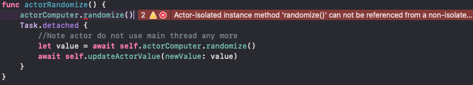
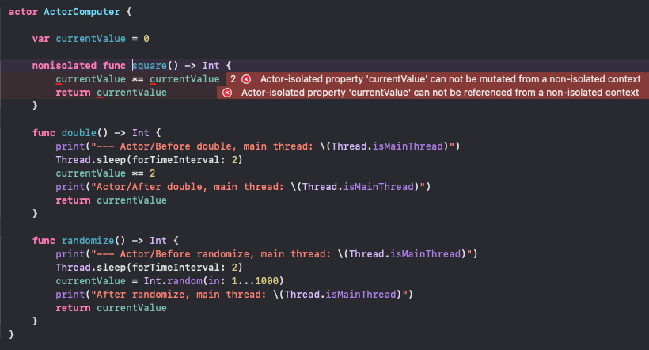

## Actor's atomicity example

Calling an actor's method must be done within `non-isolated context` (Task). Otherwise compilation finishes with error:
```
Actor-isolated instance method 'randomize()' can not be referenced from a non-isolated context
```



Calling an actor's method requires the `await` keyword, despite the actor method is not denoted as `async`.

```swift
actor ActorComputer {
    func randomize() -> Int {
        ...
    }
}
```

Actors guarantee method excution atomicity. Check below.


> Note: Using Task/Task.detached changes the thread context to a global one (see logs above).

Actors guarantee that mutable variables are updates in safe manner, because actor properties can be mutated only in an isolated context.



