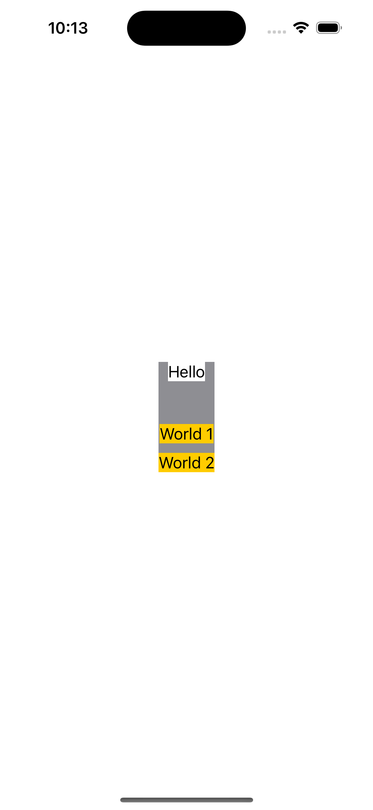

## Spacing example

### 1. `VStack(spacing: 0)`
```swift
struct ContentView: View {
    var body: some View {
        VStack(spacing: 0) {
            Text("Hello")
                .background(.white)
            Spacer()
                .frame(height: 25)
            Text("World 1")
                .background(.yellow)
            Text("World 2")
                .background(.yellow)
        }.background(.gray)
    }
}
```


### 2. `VStack(spacing: 10)`
```swift
struct ContentView: View {
    var body: some View {
        VStack(spacing: 10) { //!!! from 0 to 10
            Text("Hello")
                .background(.white)
            Spacer()
                .frame(height: 25)
            Text("World 1")
                .background(.yellow)
            Text("World 2")
                .background(.yellow)
        }.background(.gray)
    }
}
```

