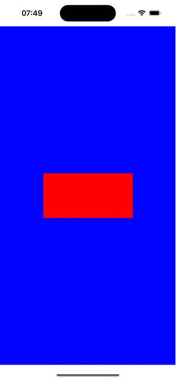

## [intrinsicContentSize](https://developer.apple.com/documentation/uikit/uiview/1622600-intrinsiccontentsize)

The **natural size** for the receiving view, considering only properties of the view itself.

Custom views typically have content that they display of which the layout system is unaware. Setting this property allows a custom view to communicate to the layout system what size it would like to be based on its content.

> By overriding `intrinsicContentSize` you do not have to specify the size of the view. 


```swift
class MyRedView: UIView {
    
    private var numberOfTaps = 0
    
    override init(frame: CGRect) {
        super.init(frame: frame)
        self.backgroundColor = .red
        let gestureRecognizer = UITapGestureRecognizer(target: self, action: #selector(onTap))
        self.addGestureRecognizer(gestureRecognizer)
    }
    
    required init?(coder: NSCoder) {
        fatalError("Not expected to be created via IB")
    }
    
    override var intrinsicContentSize: CGSize {
        CGSize(width: 100+numberOfTaps, height: 100+numberOfTaps)
    }
    
    @objc func onTap() {
        numberOfTaps += 5
        invalidateIntrinsicContentSize()
    }
}

class VC: UIViewController {
    
    override func viewDidLoad() {
        super.viewDidLoad()
        self.view.backgroundColor = .blue
        
        let v = MyRedView(frame: .zero)
        v.translatesAutoresizingMaskIntoConstraints = false
        
        self.view.addSubview(v)
        
        NSLayoutConstraint.activate([
        v.centerXAnchor.constraint(equalTo: self.view.centerXAnchor),
        v.centerYAnchor.constraint(equalTo: self.view.centerYAnchor)])
    }
}
```


> Note. If width or height constraints are specified explicitly then those have higher priority.

```swift
 NSLayoutConstraint.activate([
    v.widthAnchor.constraint(equalToConstant: 200), <<--- width set explicitly
    v.centerXAnchor.constraint(equalTo: self.view.centerXAnchor),
    v.centerYAnchor.constraint(equalTo: self.view.centerYAnchor)
])
```

