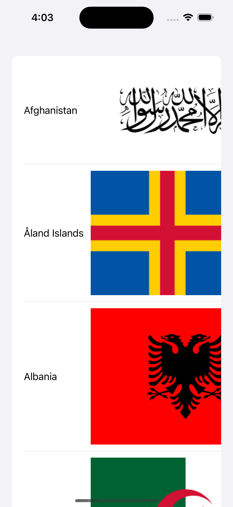

## Text example
TODO:
- Swift data
- DispatchWorkItem
- Logger
- BDD with SwiftUI
- Combine+Countries
- DatePicker


```swift
struct ContentView: View {

    var body: some View {
        Text("Hello World")
    }
}
```


