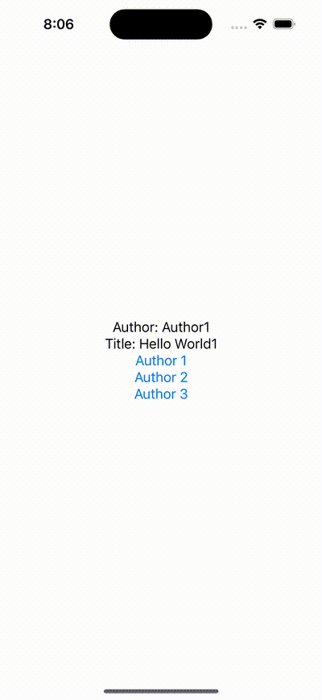

## It is possible to create a custom `AsyncSequence` which can be traversed as with `for` loop:

```swift
func load() {
        for try await data in asyncSequence {
            ...
        }
    }
}
```

It is possible by creating ą class which conforms to the `AsyncSequence` and `AsyncIteratorProtocol`

```swift
struct URLAsyncIterator: AsyncIteratorProtocol {
    
    private let urls: [URL]
    private let urlSession: URLSession = .shared
    private var index = 0
    
    init(urls: [URL]) {
        self.urls = urls
    }
    
    mutating func next() async throws -> Data? {
        guard index < urls.count else { return nil }
        
        let (data, response) = try await urlSession.data(from: urls[index])
        guard let httpResponse = response as? HTTPURLResponse else { return nil }
        guard httpResponse.statusCode == 200 else { return nil }
        
        index += 1
        return data
    }
}

struct URLSequence: AsyncSequence {
    typealias Element = Data
    
    let urls: [URL]
    func makeAsyncIterator() -> URLAsyncIterator {
        URLAsyncIterator(urls: urls)
    }
}
```


