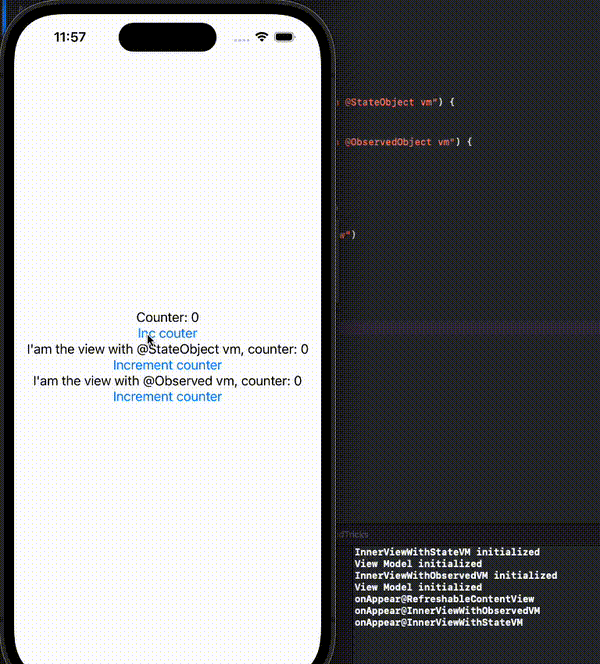
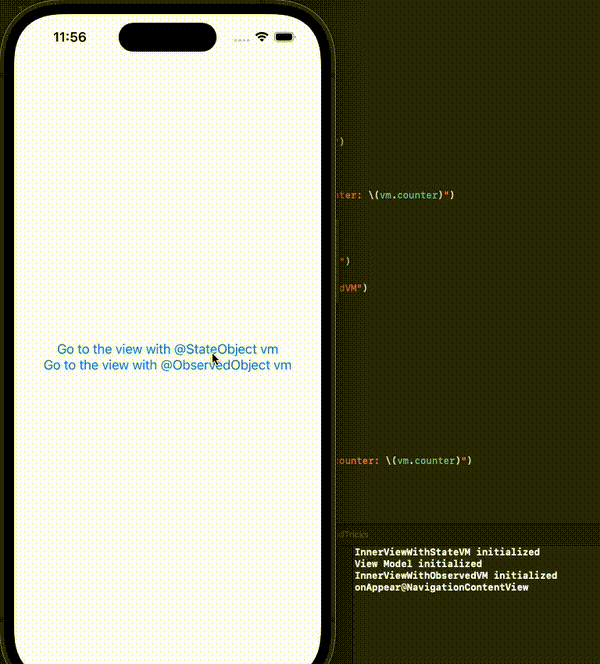

## @StateObject vs @ObservedObject

Understanding how `@StateObject` vs `@ObservedObject` is not easy.

### - **View recreation**

When a parent view is being redrawn, all children views are recreated and redrawn too. However `@StateObject` view models **are not recreated**, but `@ObservedObject` view models **are recreated**.

### - **View revisition**

The situation is different when it comes to revisiting. In a `NavigationView` revisiting does not cause to recreate views. However `@ObservedObject` view models are created as soon as holding views are declared in the `NavigationView`. Creation of `@StateObject` view models are delayed until holding views are shown (onAppear). The `@StateObject` view models **are recreated** every time the holding view appears.

