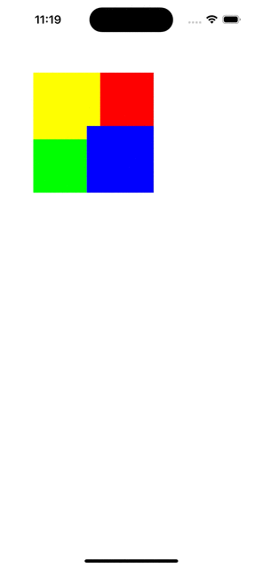

In UIKit, the zPosition property of a UIView's layer (which is a CALayer object) is used to control the stacking order of views on the z-axis, which is perpendicular to the screen (depth). This property **determines how views are layered on top of one another**. By default, all views have the same zPosition value (which is 0), and the order in which views are added to their superview determines their stacking order (the last added view is on top).

