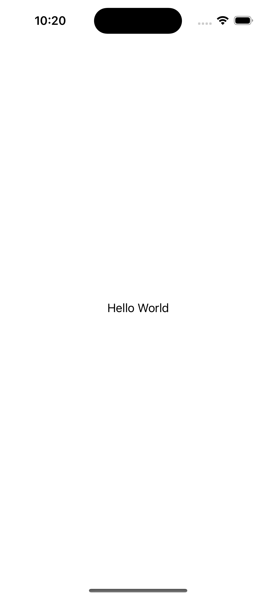

## [How to use images and other views as a backgrounds](https://www.hackingwithswift.com/quick-start/swiftui/how-to-use-images-and-other-views-as-a-backgrounds)


```swift
/*
    By default background views automatically take up as much space as they need to be fully visible, but if you want you can have them be clipped to the size of their parent view using the clipped()
*/
Text("Hello World")
    .font(.system(size: 50))
    .foregroundColor(.green)
    .padding(20)
    .background(
        Circle()
            .fill(.red)
            .frame(width: 150, height: 150)
    )
    .clipped()
```


