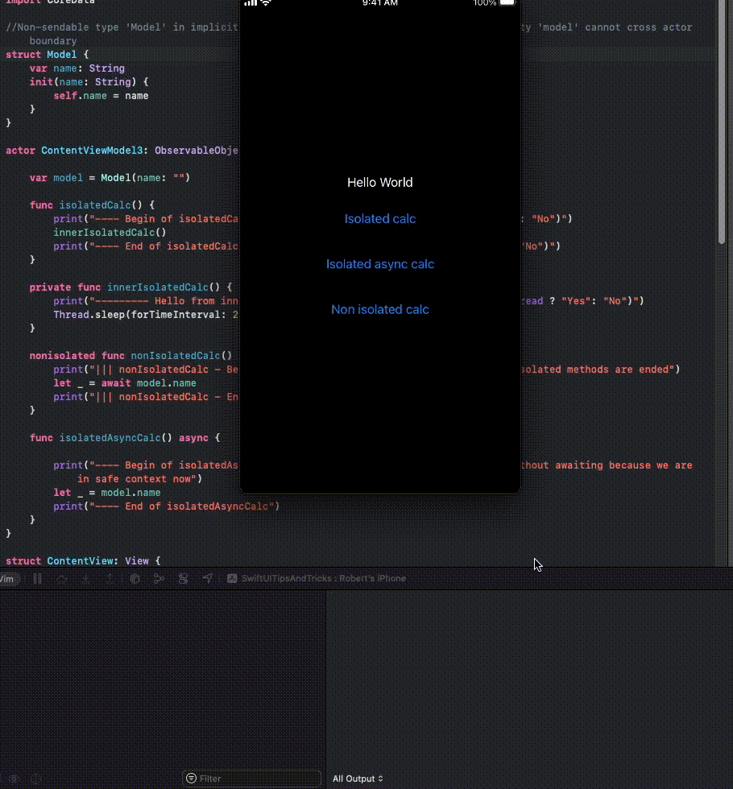

## Nonisolated, private, methods, actors

*Actors* allows to call one method at the time. However we can use **nonisolated** methods to call methods concurently.

Accessing the `actor` properties in a `nonisolated` context requires using `await` keyword.

```swift
nonisolated func nonIsolatedCalc() async {
    let _ = await model.name
}
```

The **await** blocks the execution of a `nonisolated` method until all `isolated` methods are finished.

Check below. The `nonIsolatedCalc` runs concurently to `isolatedCalc` but it gets suspended at `await model.name`. When `isolatedCalc` is ended, `await model.name` is resumed and `nonIsolatedCalc` continues.



Modifying properties from nonisolated context is impossible. Compilation fihishes with: *Actor-isolated property 'model' can not be mutated from a non-isolated context*
```swift
nonisolated func nonIsolatedCalc() async {
    await model.name = "Hello" //Raises compilation error
}
```

Meaning of *value* and *reference* types stored inside the actor.

Accessing reference types inside a `nonisolated` context raises warning shown below:


Changing `class` to `struct` resolves the issue.

## Using `async` in actors

In *actors*, *async* methods are also *synchronized*. The *async* methods wait until other `async` or normal methods are finished.

